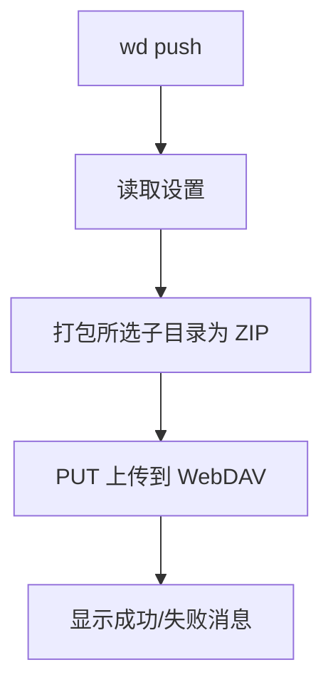
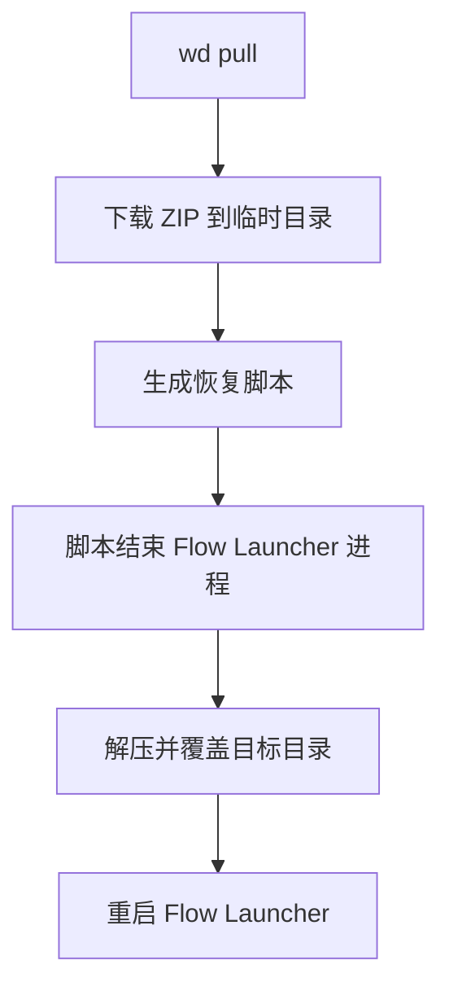

# Flow Launcher WebDAV Backup Plugin

[English](#english) | [中文](#中文)

## 中文

用于将 Flow Launcher 数据备份到 WebDAV，并在需要时一键恢复。

### 功能

- `wd push`：
  - 将已勾选的 FlowLauncher 子目录打包为 ZIP
  - 上传到 WebDAV：`flowlauncher_backup/FlowBackup_yyyyMMdd_HHmmss.zip`（基础文件名可配置）
  - 自动保留最新 3 个备份
- `wd pull`：
  - 从 WebDAV 备份列表中选择 ZIP
  - 生成临时 PowerShell 脚本执行恢复（先关闭 Flow Launcher，再覆盖文件，最后重启）
- 设置页支持：
  - 服务器地址、用户名、密码、备份文件名
  - 密码可视化切换（Show password）
  - 备份目录多选（选项来自 `%APPDATA%\FlowLauncher` 当前子目录）

### 安装

在 Flow Launcher 输入：

```text
pm install https://github.com/Liaco123/Flow.Launcher.Plugin.WebDAVBackup/releases/download/v1.1.5/Flow.Launcher.Plugin.WebDAVBackup-1.1.5.zip
```

### 使用

- 输入 `wd` 查看命令
- 输入 `wd push` 上传备份
- 输入 `wd pull` 下载并恢复

### 流程图


```mermaid
flowchart TD
    A[wd push] --> B[读取设置]
    B --> C[打包所选子目录为 ZIP]
    C --> D[PUT 上传到 WebDAV]
    D --> E[显示成功/失败消息]
```


```mermaid
flowchart TD
    A[wd pull] --> B[下载 ZIP 到临时目录]
    B --> C[生成恢复脚本]
    C --> D[脚本结束 Flow Launcher 进程]
    D --> E[解压并覆盖目标目录]
    E --> F[重启 Flow Launcher]
```

### 说明

- 为避免文件锁，恢复不在插件进程内直接覆盖，而是交给外部脚本执行。
- 恢复 `Plugins` 时会自动跳过当前插件目录，避免覆盖自身导致中断。
- 恢复 `Settings` 时会跳过当前插件配置，避免覆盖 WebDAV 连接设置。

---

## English

This plugin backs up Flow Launcher data to a WebDAV server and restores it on demand.

### Features

- `wd push`:
  - Zips selected FlowLauncher subfolders
  - Uploads to WebDAV path `flowlauncher_backup/FlowBackup_yyyyMMdd_HHmmss.zip` (base filename configurable)
  - Keeps the latest 3 backups automatically
- `wd pull`:
  - Lets you choose a ZIP from the WebDAV backup list
  - Runs a temporary PowerShell restore script (kill Flow Launcher -> overwrite files -> restart)
- Settings panel:
  - Server URL, username, password, backup filename
  - Password visibility toggle
  - Multi-select backup directories from current `%APPDATA%\FlowLauncher` subfolders

### Install

In Flow Launcher, run:

```text
pm install https://github.com/Liaco123/Flow.Launcher.Plugin.WebDAVBackup/releases/download/v1.1.5/Flow.Launcher.Plugin.WebDAVBackup-1.1.5.zip
```

### Usage

- Type `wd` to see available actions
- Type `wd push` to upload backup
- Type `wd pull` to download and restore

### Notes

- Restore is performed by an external script to avoid locked files while Flow Launcher is running.
- During `Plugins` restore, this plugin folder is skipped to avoid self-overwrite conflicts.
- During `Settings` restore, this plugin's own config is skipped to preserve WebDAV connection settings.
